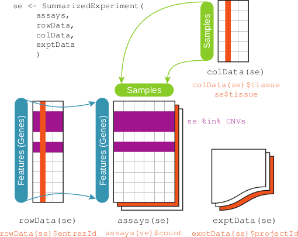

<!--
%\VignetteIndexEntry{01.1 Introduction to Bioconductor}
%\VignettePackage{UseBioconductor}
%\VignetteEngine{knitr::knitr}
-->

```{r setup, echo=FALSE}
library(LearnBioconductor)
stopifnot(BiocInstaller::biocVersion() == "3.1")
```

```{r style, echo = FALSE, results = 'asis'}
BiocStyle::markdown()
knitr::opts_chunk$set(tidy=FALSE)
```

# Introduction to _Bioconductor_

Martin Morgan, Herv&eacute; Pag&egrave;s<br/>
February 4, 2015

## Background: _R_

- Vectors: `logical()`, `integer()`, `numeric()`, `character()`, ...,
  `matrix()`, `array()`
- `list()`, `data.frame()`, ..., `new.env()`
- functions -- arguments, named arguments, argument matching, default
  values
- Statistical concepts: `NA`, `factor()`, `~` formula, ...

S3 classes

- Informal class system; `list()` with `class()` attribute; linear
  class hierarchy, single-dispatch.
- Generic `foo` (body: `UseMethod()`) and methods `foo.A`
- Help: `?foo`, `?foo.A`
- Discovery: `methods()`, `methods(class=<...>)`
- Example

```{r S3}
x <- rnorm(1000)
y <- x + rnorm(1000, .5)
df <- data.frame(x=x, y=y)
fit <- lm(y ~ x, df)
class(fit)
methods(class=class(fit))
methods(anova)
plot(y ~ x, df)
abline(fit, col="red", lwd=2)
```

S4 classes

- Formal classes via `setClass()`, multiple inheritance, multiple
  dispatch
- Generic `foo` and associated methods (`showMethods("foo")`)
- Help: `?foo`, `method?foo,A`, `class?A`
- Discovery: `showMethods("foo")`, `showMethods(classes="A",
  where=search())`
  
- Example

```{r S4}
suppressPackageStartupMessages({
    library(IRanges)
})
start <- as.integer(runif(1000, 1, 1e4))
width <- as.integer(runif(length(start), 50, 100))
ir <- IRanges(start, width=width)
coverage(ir)
findOverlaps(ir)
showMethods("coverage")
```

```{r showMethods, eval=FALSE}
showMethods(classes=class(ir), where=search())
```

Notes

- Package authors are at liberty to document classes and methods as
  they see fit, e.g., all methods on the same page as their class
- Methods are defined independently of class, so available methods can
  depend on loaded packages, e.g., compare to previous
  
```{r S4-methods}
suppressPackageStartupMessages({
    library(GenomicRanges)
})
showMethods("coverage")
```

## Principles

1. Statistical
   - Volume, technology, experimental design
2. Extensive
   - Software, annotation
   - Core and community contributions
   - Leading edge
3. Interoperable
   - Common data structures, e.g., `GRanges`
4. Reproducible
   - Integrated data containers, e.g., `SummarizedExperiment`
   - Vignettes & "old school" scripts
5. Accessible -- affordable, transparent, usable
   - `example(findOverlaps)`
   - `browseVignettes("IRanges")`

## Infrastructure

Genomic Ranges

- `GRanges`

  

- `GRangesList`

  


Integrating sample, range and assay data

- `SummarizedExperiment`

  

## Key packages

`r Biocpkg("GenomicRanges")` -- Ranges

- Builds on `r Biocpkg("IRanges")`
- `r Biocpkg("GenomicAlignments")`  -- aligned reads
- `r Biocpkg("GenomicFeatures")` -- feature-based annotation

`r Biocpkg("Biostirings")` -- Sequences

- `r Biocpkg("BSgenome")` -- Whole-geneome
- `r Biocpkg("ShortRead")` -- Short read / fastq

`r Biocpkg("BiocParallel")` -- Parallel processing

- `r Biocpkg("GenomicFiles")` -- Collections of 'genomic' (e.g., BAM,
  BED, WIG, ...) files

## Work flows

[biocViews](http://bioconductor.org/packages/release/BiocViews.html#___Software)
for discovery.

RNA-seq

- Genes -- `r Biocpkg("edgeR")`, `r Biocpkg("DESeq2")`
- Transcripts -- `r Biocpkg("DEXSeq")`, `r Biocpkg("BitSeq")`,
  `r Biocpkg("SGSeq")`

ChIP-seq

- QC -- `r Biocpkg("ChIPQC")`
- Differential binding  -- `r Biocpkg("DiffBind")`, `r Biocpkg("csaw")`
- Annotation -- `r Biocpkg("ChIPseeker")`

Variants

- Calling -- `r Biocpkg("VariantTools")`, `r Biocpkg("h5vc")`,
  `r Biocpkg("Rariant")`
- Manipulation and annotation -- `r Biocpkg("VariantAnnotation")`, 
  `r Biocpkg("ensemblVEP")`, `r Biocpkg("VariantFiltering")`

Copy number

Methylation

- Bump hunting -- `r Biocpkg("minfi")`
- Visualization -- `r Biocpkg("epivizR")` (much more than epigenomics!)

Expression and other arrays

- Pre-processing -- `r Biocpkg("oligo")`
- Differential representation -- `r Biocpkg("limma")`
