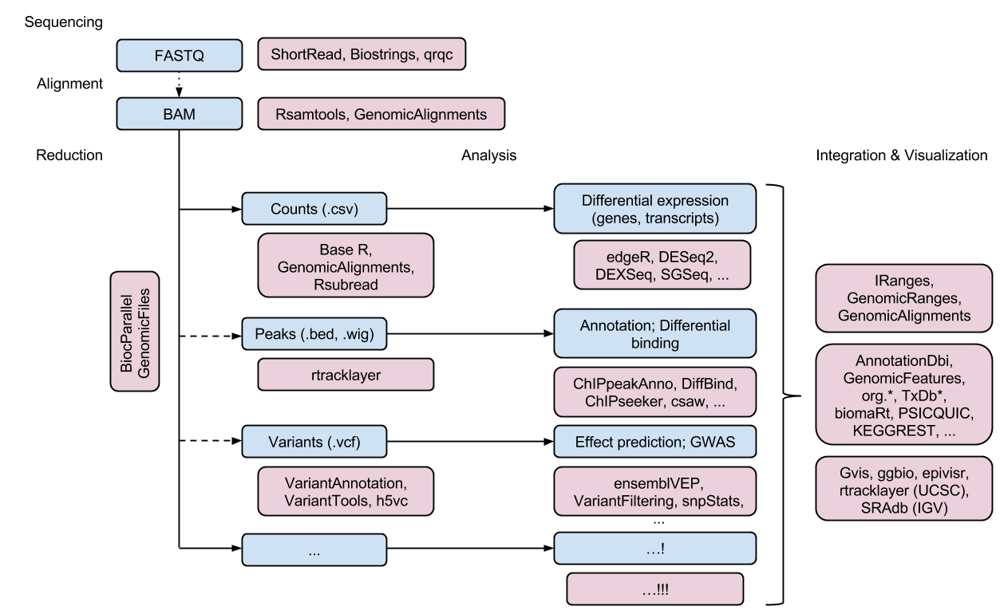

```{r style, echo=FALSE, results='asis'}
BiocStyle::markdown()
```

# Introduction

This **INTERMEDIATE** course is designed for individuals comfortable
using _R_, and with some familiarity with _Bioconductor_. It consists
of approximately equal parts lecture and practical sessions addressing
use of _Bioconductor_ software for analysis and comprehension of
high-throughput sequence and related data. Specific topics include use
of central Bioconductor classes (e.g., _GRanges_,
_SummarizedExperiment_), RNASeq gene differential expression, ChIP-seq
and methylation work flows, approaches to management and integrative
analysis of diverse high-throughput data types, and strategies for
working with large data. Participants are required to bring a laptop
with wireless internet access and a modern version of the Chrome or
Safari web browser.

# Schedule (tentative)

Day 1 (9:00 - 12:30; 1:30 - 5:00)

- [B. Genomic Ranges](B_GenomicRanges.html). Working with Genomic
  Ranges and other _Bioconductor_ data structures (e.g., in the
  [GenomicRanges](http://bioconductor.org/packages/devel/bioc/html/GenomicRanges.html).
  package).  
- [C. Differential Gene Expression](C_DifferentialExpression.html). RNA-Seq
  known gene differential expression with
  [DESeq2](http://bioconductor.org/packages/devel/bioc/html/DESeq2.html)
  and
  [edgeR](http://bioconductor.org/packages/devel/bioc/html/edgeR.html).
- [D. Machine Learning](D_MachineLearning.html).
- [E. Gene Set Enrichment](E_GeneSetEnrichment.html).

Day 2 (9:00 - 12:30; 1:30 - 5:00)

- [F. ChIP-seq](F_ChIPSeq.html) ChIP-seq with
  [csaw](http://bioconductor.org/packages/devel/bioc/html/csaw.html)
- [G. Methylation](G_Methylation.html) and regulatory work flows with
  [minfi](http://bioconductor.org/packages/devel/bioc/html/minfi.html).
- [H. Integrative Data Analysis](H_IntegrativeAnalysis.html) -- emerging
  approaches
- [I. Large Data](I_LargeData.html) -- efficient, parallel, and cloud
  programming with
  [BiocParallel](http://bioconductor.org/packages/devel/bioc/html/BiocParallel.html),
  [GenomicFiles](http://bioconductor.org/packages/devel/bioc/html/GenomicFiles.html),
  and other resources.

# Bioconductor

Analysis and comprehension of high throughput genomic data

- Sequencing, microarrays, proteomics, flow cytometry, imaging, ...
- Recent publication: Huber et al., Orchestrating high-throughput
  genomic analysis with Bioconductor. Nature Methods
  12:[115-121](http://www.nature.com/nmeth/journal/v12/n2/abs/nmeth.3252.html)

Packages

- Software
- Annotation -- static, versioned annotations, e.g., genome sequences,
  gene models, gene identifiers
- Experiment data -- example experiments used to illustrate work
  flows and analysis
- Recently: `r Biocpkg("AnnotationHub")` for easy web-based retrieval
  of genome-scale annotation

# Sequencing work flows & ecosystem

0. Research question
1. Experimental Design
2. Wet lab
3. Sequencing
4. Alignment
5. _Reduction_
6. _Analysis_
7. _Comprehension_ (annotation, integration, visualization)


