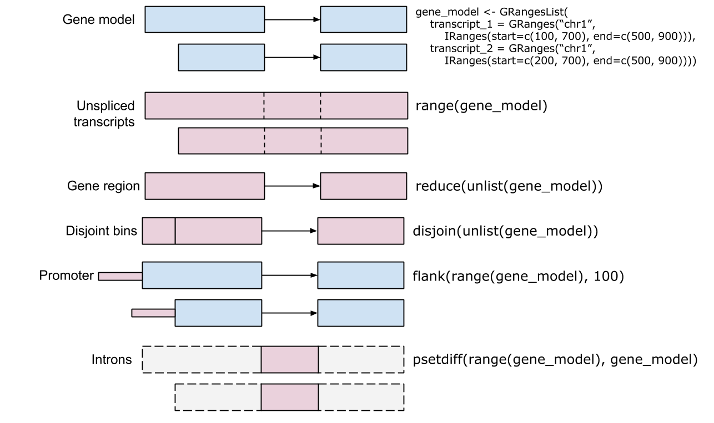
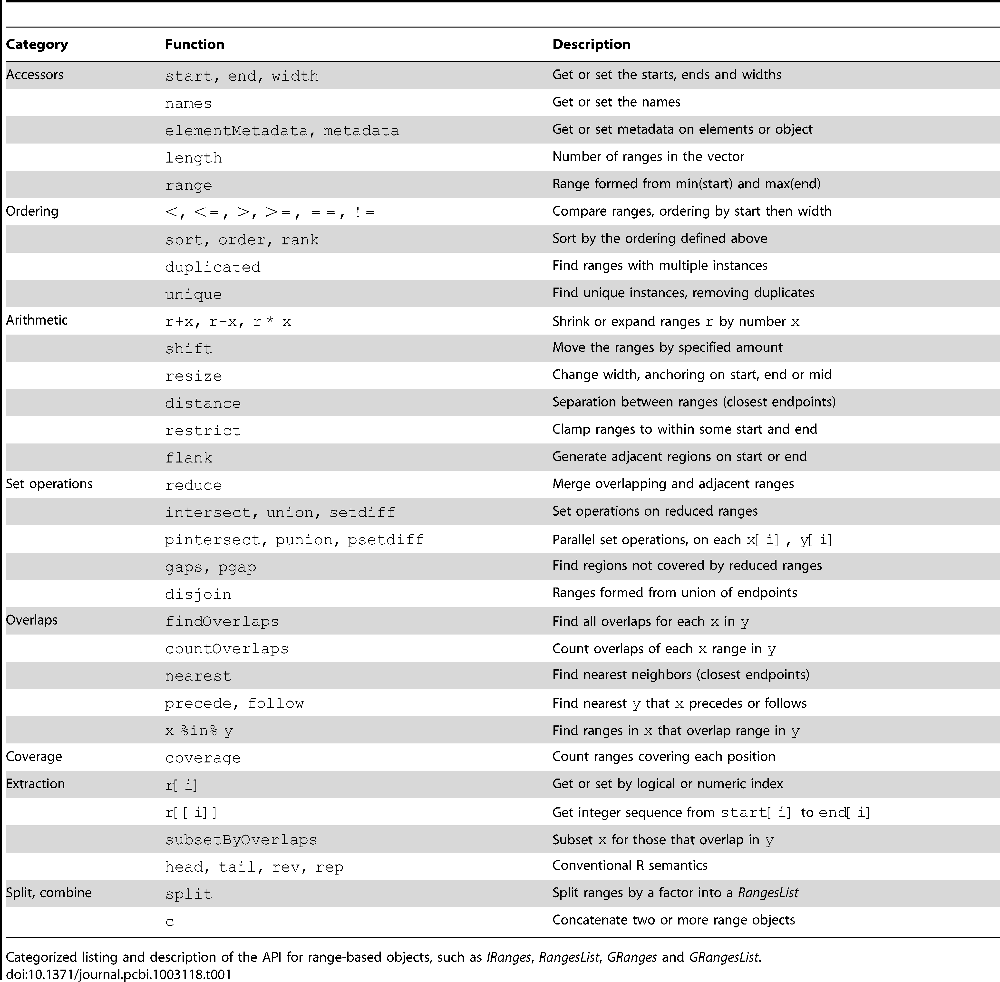
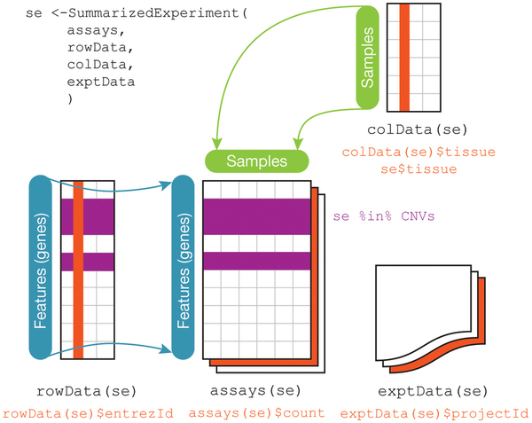
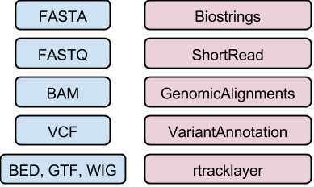

```{r style, echo=FALSE, results='asis'}
BiocStyle::markdown()
suppressPackageStartupMessages({
   library(GenomicAlignments)
   library(BSgenome.Hsapiens.UCSC.hg19)
   library(TxDb.Hsapiens.UCSC.hg19.knownGene)
})
```

# Motivation

Genomic ranges describe...

- Annotations, e.g., exons, genes, binding sites, ..
- Data, e.g., aligned reads, called peaks, copy number regions
- See Lawrence et al., Software for computing and annotating genomic
  ranges, PLoS Comput Biol 9(8):
  [e1003118](http://dx.doi.org/10.1371/journal.pcbi.1003118)

Packages

- `r Biocpkg("GenomicRanges")` for essential genomic ranges; depends
  on `r Biocpkg("IRanges")`, `r Biocpkg("S4Vectors")` and other
  packages
- `r Biocpkg("GenomicAlignments")` for aligned reads using genomic
  range-based concepts. Depends on `r Biocpkg("Rsamtools")`, `r
  Biocpkg("Biostrings")` and other packages

```{r packages}
library(GenomicRanges)
library(GenomicAlignments)
sessionInfo()
```

## Use cases

`GRanges`: simple genomic ranges

- e.g., exons, binding sites
- e.g., called peaks, reads aligned without gaps
- _vector_ of genomic ranges
- _metadata_ `mcols()` of associated data, e.g., 'score', 'id', ...


- `seqname()`, e.g., chromosome, but could be, e.g., contig, ...
- `start()`, `end()`: 1-based, closed intervals
- `strand()`: +, -, or * (does not matter)
- `mcols()`

`GRangesList`: nested genomic ranges

- e.g., exons-within-transcripts
- e.g., aligned reads with gaps; paired-end reads


- Accessors resturn `*List` objects: lists, but all elements of the
  same type. E.g., `start()` returns an `IntegerList()`.
- `unlist()`

# Range-based operations



Intra-range operations

- e.g., `range()`, `flank()`

Inter-range operations

- e.g., `reduce()`, `disjoin()`

Between-object

- e.g., `psetdiff()`, `findOverlaps()`, `countOverlaps()`



PLoS Comput Biol 9(8):
[e1003118](http://dx.doi.org/10.1371/journal.pcbi.1003118)

# Working with _Bioconductor_ classes and methods

What can I do with my `GRanges` instance?

```{r methods-class}
methods(class="GRanges")
```

What type of object(s) can I use `findOverlaps()` on (what _methods_
exist for the `findOverlaps()` _generic_)?

```{r methods-generic}
methods(findOverlaps)
```

How can I get help on functions, generics, and methods?

```{r help, eval=FALSE}
?"findOverlaps"          ## generic
?"findOverlaps,<tab>"    ## specific method
```

Other help?

- Vignettes, e.g., `browseVignettes("GenomicRanges")`
- Work flows, vidoes, training material on the Bioconductor
  [web site](http://bioconductor.org/)
- Questions and answers on the Bioconductor
  [support site](https://support.bioconductor.org)

# Important parts of the sequence class menagerie

`GAlignments` and friends (`r Biocpkg("GenomicAlignments")`)

- `GAlignments`: Single-end aligned reads, e.g., from BAM files
- `GAlignmentPairs`, `GAlignmentsList`: paired-end aligned
  reads. `*Pairs` is more restrictive on what pairs can be represented

`DNAString` and `DNAStringSet` (`r Biocpkg("Biostrings")`)

`SummarizedExperiment` (`r Biocpkg("GenomicRanges")`)



- `assays` of rows (regions of interest; genomic ranges) x columns
  (samples, including integrated phenotypic information)

`TxDb` (`r Biocpkg("AnnotationDb")`)

- Coordinating transcript-level descriptions derived, e.g., from GTF,
  UCSC, Biomart
- `transcripts()` interface
- `select()` interface

`VCF` (`r Biocpkg("VariantAnnotation")`)

Lower-level classes

- `DataFrame` (`r Biocpkg("S4Vectors")`) (like a `data.frame`, but can
  contain S4 objects)
- `IRanges` (`r Biocpkg("IRanges")`), `Rle` (`r Biocpkg("S4Vectors")`)



# Deeper understanding

## Classes and class hierarchies

- 'Ideally', the user can remain ignorant of how classes are
  implemented. Actually, it sometimes helps!
- Slots
- Contained classes

_R_ works efficiently on vectors

- Represent `GRanges` as a collection of vectors, not as a collection
  of records

```{r getClass-GRanges}
getClass("GRanges")
```


## `Vector` and `Annotated`

- `[`, `length()`, `names()`, etc.
- `mcols()`

## `List`-like

- `[[`
- `elementLengths()`

Implementation: `Vector` plus partitioning

- Consequence: `unlist()` and `relist()` are very inexpensive


# Practical

## 1. Exon and transcript characterization

Ingredients

- `r Biocpkg("TxDb.Hsapiens.UCSC.hg19")` TxDb package
- `exons()`, and `exonsBy()` functions
- `width()`, `elementLengths()` accessors
- `hist()`

Goals

- Histogram of exon widths
- Histogram of transcript widths
- Transcripts with exactly one exon
- Transcripts with maximum number of exons

## 2. GC content

Ingredients
- `r Biocpkg("BSgenome.Hsapiens.UCSC.hg19")` BSGenome package
- `r Biocpkg("TxDb.Hsapiens.UCSC.hg19")` TxDb package
- `getSeq,BSgenome-method`

Goapls

- GC content of exons, transcripts
- GC content of non-coding regions

## 3. CpG islands

Ingredients

- `DNAStringSet()` to construct CG island sequence
- `matchPDict()` to find CG islands on BSgenome chromosomes
- ?? `coverage()`, `tileGenome()`, `Views()`, following [Hints](https://support.bioconductor.org/p/65281/)
- ?? `tileGenome()`, `findOverlaps()`, `splitAsList()`, `mean()`

Goal

- Average number of CpG islands in 'tiles' across chr 17

## 4. Aligned reads

Ingredients

- `r Biocexptpkg("RNAseqData.HNRNPC.bam.chr14")` and
  `RNAseqData.HNRNPC.bam.chr14_BAMFILES`
- `readGAlignments()`, `readGAlignmentPairs()`, and
  `readGAlignmentsList()`
- `BamFile()`n
  
Goals

- Compare three input methods
- Use `ScanBamParam()` `which` and `what` to selective input data
- Use `BamFile()` `yieldSize` argument to iterate through file

