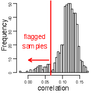

```{r style, echo=FALSE, results='asis'}
BiocStyle::markdown()
options(max.print=1000)
suppressPackageStartupMessages({
    library(genefilter)
    library(airway)
    library(DESeq2)
    library(GenomicAlignments)
    library(GenomicFeatures)
})
```

# Work flow

## 1. Experimental design

Keep it simple

- Classical experimental designs
- Time series
- Without missing values, where possible
- Intended analysis must be feasbile -- can the available samples and
  hypothesis of interest be combined to formulate a testable
  statistical hypothesis?

Replicate

- Extent of replication determines nuance of biological question.
- No replication (1 sample per treatment): qualitative description
  with limited statistical options.
- 3-5 replicates per treatment: designed experimental manipulation
  with cell lines or other well-defined entities; 2-fold (?)
  change in average expression between groups.
- 10-50 replicates per treatment: population studies, e.g., cancer
  cell lines.
- 1000's of replicates: prospective studies, e.g., SNP discovery
- One resource: `r Biocpkg("RNASeqPower")`

Avoid confounding experimental factors with other factors

- Common problems: samples from one treatment all on the same flow
  cell; samples from treatment 1 processed first, treatment 2
  processed second, etc.

Record co-variates
       
Be aware of _batch effects_

- Known

    - Phenotypic covariates, e.g., age, gender
    - Experimental covariates, e.g., lab or date of processing
    - Incorporate into linear model, at least approximately

- Unknown

    - Or just unexpected / undetected
    - Characterize using, e.g., `r Biocpkg("sva")`.
  
- Surrogate variable analysis

    - Leek et al., 2010, Nature Reviews Genetics 11
      [733-739](http://www.nature.com/nrg/journal/v11/n10/abs/nrg2825.html),
      Leek & Story PLoS Genet 3(9):
      [e161](http://dx.doi.org/10.1371/journal.pgen.0030161).
    - Scientific finding: pervasive batch effects
    - Statistical insights: surrogate variable analysis: identify and
      build surrogate variables; remove known batch effects
    - Benefits: reduce dependence, stabilize error rate estimates, and
      improve reproducibility
    - _combat_ software / `r Biocpkg("sva")` _Bioconductor_ package 
    
   
  HapMap samples from one facility, ordered by date of processing.

## 2. Wet-lab

Confounding factors

- Record or avoid

Artifacts of your _particular_ protocols

- Sequence contaminants
- Enrichment bias, e.g., non-uniform transcript representation.
- PCR artifacts -- adapter contaminants, sequence-specific
  amplification bias, ...

## 3. Sequencing

Axes of variation

- Single- versus paired-end
- Length: 50-200nt
- Number of reads per sample

Application-specific, e.g.,

- ChIP-seq: short, single-end reads are usually sufficient
- RNA-seq, known genes: single- or  paired-end reads
- RNA-seq, transcripts or novel variants: paired-end reads
- Copy number: single- or paired-end reads
- Structural variants: paired-end reads
- Variants: depth via longer, paired-end reads
- Microbiome: long paired-end reads (overlapping ends)

## 4. Alignment

Alignment strategies

- _de novo_
  - No reference genome; considerable sequencing and computational
    resources
- Genome
  - Established reference genome
  - Splice-aware aligners
  - Novel transcript discovery
- Transcriptome
  - Established reference genome; reliable gene model
  - Simple aligners
  - Known gene / transcript expression

Splice-aware aligners (and _Bioconductor_ wrappers)

- [Bowtie2](http://bowtie-bio.sourceforge.net/bowtie2) (`r Biocpkg("Rbowtie")`)
- [STAR](http://bowtie-bio.sourceforge.net/bowtie2)
  ([doi](http://dx.doi.org/10.1093/bioinformatics/bts635))
- [subread](http://dx.doi.org/10.1093/nar/gkt214) (`r Biocpkg("Rsubread")`)
- Systematic evaluation (Engstrom et al., 2013,
  [doi](http://dx.doi.org/10.1038/nmeth.2722))

## (5a. Bowtie2 / tophat / Cufflinks / Cuffdiff / etc)

- [tophat](http://ccb.jhu.edu/software/tophat) uses Bowtie2 to perform
  basic single- and paired-end alignments, then uses algorithms to
  place difficult-to-align reads near to their well-aligned mates.
- [Cufflinks](http://cole-trapnell-lab.github.io/cufflinks/)
  ([doi](http://dx.doi.org/10.1038/nprot.2012.016)) takes _tophat_
  output and estimate existing and novel transcript abundance.
  [How Cufflinks Works](http://cufflinks.cbcb.umd.edu/howitworks.html)
- [Cuffdiff](http://cole-trapnell-lab.github.io/cufflinks/cuffdiff/)
  assesses statistical significance of estimated abundances between
  experimental groups
- [RSEM](http://www.biomedcentral.com/1471-2105/12/323) includes de
  novo assembly and quantification

## 5. Reduction to 'count tables'

- Use known gene model to count aligned reads overlapping regions of
  interest / gene models
- Gene model can be public (e.g., UCSC, NCBI, ENSEMBL) or _ad hoc_ (gff file)
- `GenomicAlignments::summarizeOverlaps()`
- `Rsubread::featureCount()`
- [HTSeq](http://www-huber.embl.de/users/anders/HTSeq/doc/overview.html),
  [htseq-count](http://www-huber.embl.de/users/anders/HTSeq/doc/count.html)

## 6. Analysis

Unique statistical aspects

- Large data, few samples
- Comparison of each gene, across samples; _univariate_ measures
- Each gene is analyzed by the _same_ experimental design, under the
  _same_ null hypothesis

Summarization

- Counts _per se_, rather than a summary (RPKM, FRPKM, ...), are
  relevant for analysis
  - For a given gene, larger counts imply more information; RPKM etc.,
    treat all estimates as equally informative.
  - Comparison is across samples at _each_ region of interest; all
    samples have the same region of interest, so modulo library size
    there is no need to correct for, e.g., gene length or mapability.

Normalization

- Libraries differ in size (total counted reads per sample) for
  un-interesting reasons; we need to account for differences in
  library size in statistical analysis.
- Total number of counted reads per sample is _not_ a good estimate of
  library size. It is un-necessarily influenced by regions with large
  counts, and can introduce bias and correlation across
  genes. Instead, use a robust measure of library size that takes
  account of skew in the distribution of counts (simplest: trimmed
  geometric mean; more advanced / appropriate encountered in the lab).
- Library size (total number of counted reads) differs between
  samples, and should be included _as a statistical offset_ in
  analysis of differential expression, rather than 'dividing by' the
  library size early in an analysis.

Appropriate error model

- Count data is _not_ distributed normally or as a Poisson process,
  but rather as negative binomial. 
- Result of a combination Poisson (`shot' noise, i.e., within-sample
  technical and sampling variation in read counts) with variation
  between biological samples.
- A negative binomial model requires estimation of an additional
  parameter ('dispersion'), which is estimated poorly in small
  samples.
- Basic strategy is to moderate per-gene estimates with more robust
  local estimates derived from genes with similar expression values (a
  little more on borrowing information is provided below).

Pre-filtering

- Naively, a statistical test (e.g., t-test) could be applied to each
  row of a counts table. However, we have relatively few samples
  (10's) and very many comparisons (10,000's) so a naive approach is
  likely to be very underpowered, resulting in a very high _false
  discovery rate_
- A simple approach is perform fewer tests by removing regions that
  could not possibly result in statistical significance, regardless of
  hypothesis under consideration.
- Example: a region with 0 counts in all samples could not possibly be
  significant regradless of hypothesis, so exclude from further
  analysis.
- Basic approaches: 'K over A'-style filter -- require a minimum of A
  (normalized) read counts in at least K samples. Variance filter,
  e.g., IQR (inter-quartile range) provides a robust estimate of
  variability; can be used to rank and discard least-varying regions.
- More nuanced approaches: `r Biocpkg("edgeR")` vignette; work flow
  today.

Borrowing information

- Why does low statistical power elevate false discovery rate?
- One way of developing intuition is to recognize a t-test (for
  example) as a ratio of variances. The numerator is
  treatment-specific, but the denominator is a measure of overall
  variability.
- Variances are measured with uncertainty; over- or under-estimating
  the denominator variance has an asymmetric effect on a t-statistic
  or similar ratio, with an underestimate _inflating_ the statistic
  more dramatically than an overestimate deflates the statistic. Hence
  elevated false discovery rate.
- Under the typical null hypothesis used in microarray or RNA-seq
  experiments, each gene may respond differently to the treatment
  (numerator variance) but the overall variability of a gene is
  the same, at least for genes with similar average expression
- The strategy is to estimate the denominator variance as the
  between-group variance for the gene, _moderated_ by the average
  between-group variance across all genes.
- This strategy exploits the fact that the same experimental design
  has been applied to all genes assayed, and is effective at
  moderating false discovery rate.

## 7. Comprehension

Placing differentially expressed regions in context

- Gene names associated with genomic ranges
- Gene set enrichment and similar analysis
- Proximity to regulatory marks
- Integrate with other analyses, e.g., methylation, copy number,
  variants, ...
  
  
  Correlation between genomic copy number and mRNA expression
  identified 38 mis-labeled samples in the TCGA ovarian cancer
  Affymetrix microarray dataset.

# Experimental and statistical issues in depth

## Normalization

`r Biocpkg("DESeq2")` `estimateSizeFactors()`, Anders and Huber,
[2010](http://genomebiology.com/2010/11/10/r106)

- For each gene: geometric mean of all samples.
- For each sample: median ratio of the sample gene over the geometric
  mean of all samples
- Functions other than the median can be used; control genes can be
  used instead

`r Biocpkg("edgeR")` `calcNormFactors()` TMM method of Robinson and
Oshlack, [2010](http://genomebiology.com/2010/11/3/r25)

- Identify reference sample: library with upper quartile closest to
  the mean upper quartile of all libraries
- Calculate M-value of each gene (log-fold change relative to reference)
- Summarize library size as weighted trimmed mean of M-values.

## Dispersion

`r Biocpkg("DESeq2")` `estimateDispersions()`

- Estimate per-gene dispersion
- Fit a smoothed relationship between dispersion and abundance

`r Biocpkg("edgeR")` `estimateDisp()`

- Common: single dispersion for all genes; appropriate for small
  experiments (<10? samples)
- Tagwise: different dispersion for all genes; appropriate for larger
  / well-behaved experiments
- Trended: bin based on abundance, estimate common dispersion within
  bin, fit a loess-smoothed relationship between binned dispersion and
  abundance

# Analysis of designed experiments in R

## Example: t-test

`t.test()`

- `x`: vector of univariate measurements
- `y`: `factor` describing experimental design
- `var.equal=TRUE`: appropriate for relatively small experiments where
  no additional information available?
- `formula`: alternative representation, `y ~ x`.

```{r sleep-t.test}
head(sleep)
plot(extra ~ group, data = sleep)
## Traditional interface
with(sleep, t.test(extra[group == 1], extra[group == 2]))
## Formula interface
t.test(extra ~ group, sleep)
## equal variance between groups
t.test(extra ~ group, sleep, var.equal=TRUE)
```

`lm()` and `anova()`

- `lm()`: fit _linear model_.
- `anova()`: statisitcal evaluation.

```{r sleep-lm}
## linear model; compare to t.test(var.equal=TRUE)
fit <- lm(extra ~ group, sleep)
anova(fit)
```

- Under the hood: `formula`: translated into _model matrix_, used in
  `lm.fit()`.
- With (implicit) intercept 1, last coefficient of model matrix
  reflects group effect
- With intercept 0, _contrast_ between effects of coefficient 1 and
  coefficient 2 reflect group effect 

```{r sleep-model.matrix}
## underlying model, used in `lm.fit()`
model.matrix(extra ~ group, sleep)     # last column indicates group effect
model.matrix(extra ~ 0 + group, sleep) # contrast between columns
```

- Covariate -- fit base model containing only covariate, test
  improvement in fit when model includes factor of interest

```{r sleep-diff}
fit0 <- lm(extra ~ ID, sleep)
fit1 <- lm(extra ~ ID + group, sleep)
anova(fit0, fit1)
t.test(extra ~ group, sleep, var.equal=TRUE, paired=TRUE)
```

`genefilter::rowttests()`

- t-tests for gene expression data
- useful for exploratory analysis, but statistically sub-optimal
- `x`: matrix of expression values
- features x samples (reverse of how a 'statistician' would
  represent the data -- samples x features)

- `fac`: factor of one or two levels describing experimental design

Limitations

- Assumes features are _independent_
- Ignores common experimental design
- Ignores multiple testing

Consequences

- Poor estimate of between-group variance for each feature
- Elevated false discovery rate

## Common experimental designs

- t-test: `count ~ factor`. Alternative: `count ~ 0 + factor` and
  contrasts
- covariates: `count ~ covariate + factor`
- Single factor, multiple levels (one-way ANOVA) -- statistical
  contrasts: specify model as `count ~ factor` or `count ~ 0 + factor`
- Factorial designs -- main effects, `count ~ factor1 + factor2`; main
  effects and interactions, `count ~ factor1 * factor2`. Contrasts to
  ask specific questions
- Paired designs: include ID as covariate (approximate, since ID is a
  random effect); `r Biocpkg("limma")` approach:
  `duplicateCorrelation()`

# Practical: RNA-Seq gene-level differential expression

Adapted from Love, Anders, and Huber's Bioconductor
[work flow](http://bioconductor.org/help/workflows/rnaseqGene/)

Michael Love [1], Simon Anders [2], Wolfgang Huber [2]

[1] Department of Biostatistics, Dana-Farber Cancer Institute and
Harvard School of Public Health, Boston, US; 

[2] European Molecular Biology Laboratory (EMBL), Heidelberg, Germany.

## 1. Experimental design

The data used in this workflow is an RNA-Seq experiment of airway
smooth muscle cells treated with dexamethasone, a synthetic
glucocorticoid steroid with anti-inflammatory effects. Glucocorticoids
are used, for example, in asthma patients to prevent or reduce
inflammation of the airways. In the experiment, four primary human
airway smooth muscle cell lines were treated with 1 micromolar
dexamethasone for 18 hours. For each of the four cell lines, we have a
treated and an untreated sample. The reference for the experiment is:

Himes BE, Jiang X, Wagner P, Hu R, Wang Q, Klanderman B, Whitaker RM,
Duan Q, Lasky-Su J, Nikolos C, Jester W, Johnson M, Panettieri R Jr,
Tantisira KG, Weiss ST, Lu Q. "RNA-Seq Transcriptome Profiling
Identifies CRISPLD2 as a Glucocorticoid Responsive Gene that Modulates
Cytokine Function in Airway Smooth Muscle Cells." PLoS One. 2014 Jun
13;9(6):e99625.
PMID: [24926665](http://www.ncbi.nlm.nih.gov/pubmed/24926665).
GEO: [GSE52778](http://www.ncbi.nlm.nih.gov/geo/query/acc.cgi?acc=GSE52778).

## 2, 3, and 4: Wet lab, sequencing, and alignment

- Paired-end sequencing leading to
  [FASTQ](http://en.wikipedia.org/wiki/FASTQ_format) files of reads
  and their quality scores.

- Reads aligned to a reference genome or transcriptome, resulting in
  [BAM](http://samtools.github.io/hts-specs) files.  Reads for this
  experiment were aligned to the Ensembl release 75 human reference
  genome using the [STAR](https://code.google.com/p/rna-star/) aligner

## 5. Reduction

We use the `r Biocexptpkg("airway")` package to illustrate
reduction. The package provides sample information, a subset of eight
BAM files, and the known gene models required to count the reads.

```{r airway-bam-path}
library(airway)
path <- system.file(package="airway", "extdata")
dir(path)
```

### Setup

The ingredients for counting include are:

a. Metadata describing samples. Read this using `read.csv()`.

```{r airway-csv}
csvfile <- dir(path, "sample_table.csv", full=TRUE)
sampleTable <- read.csv(csvfile, row.names=1)
head(sampleTable)
```

b. BAM files containing aligned reads. Create an object that
references these files. What does the `yieldSize` argument mean?

```{r airway-bam}
library(Rsamtools)
filenames <- dir(path, ".bam$", full=TRUE)
bamfiles <- BamFileList(filenames, yieldSize=1000000)
names(bamfiles) <- sub("_subset.bam", "", basename(filenames))
```

c. Known gene models. These might come from an existing `TxDb`
package, or created from biomart or UCSC, or from a
[GTF file](http://www.ensembl.org/info/website/upload/gff.html). We'll
take the hard road, making a TxDb object from the GTF file used to
align reads and using the TxDb to get all exons, grouped by gene.

```{r airway-gtf-to-txdb}
library(GenomicFeatures)
gtffile <- file.path(path, "Homo_sapiens.GRCh37.75_subset.gtf")
txdb <- makeTxDbFromGFF(gtffile, format="gtf", circ_seqs=character())
genes <- exonsBy(txdb, by="gene")
```

### Counting

After these preparations, the actual counting is easy. The function
`summarizeOverlaps()` from the `r Biocpkg("GenomicAlignments")`
package will do this. This produces a `SummarizedExperiment` object,
which contains a variety of information about an experiment

```{r}
library(GenomicAlignments)
se <- summarizeOverlaps(features=genes, reads=bamfiles,
                        mode="Union",
                        singleEnd=FALSE,
                        ignore.strand=TRUE,
                        fragments=TRUE)
colData(se) <- as(sampleTable, "DataFrame")
se
colData(se)
rowData(se)
head(assay(se))
```

## 6. Analysis using `r Biocpkg("DESeq2")`

The previous section illustrates the reduction step on a subset of the
data; here's the full data set

```{r airway-data}
data(airway)
se <- airway
```

This object contains an informative `colData` slot -- prepared as
described in the `r Biocexptpkg("airway")` vignette.  In particular,
the `colData()` include columns describing the cell line `cell` and
treatment `dex` for each sample

```{r airway-cell-dex}
colData(se)
```

`r Biocpkg("DESeq2")` makes the analysis particularly easy, simply add
the experimental design, run the pipeline, and extract the results

```{r airway-DESeq2-design}
library(DESeq2)
dds <- DESeqDataSet(se, design = ~ cell + dex)
dds <- DESeq(dds)
res <- results(dds)
```

Simple visualizations / sanity checks include

- Look at counts of strongly differentiated genes, to get a sense of
  how counts translate to the summary statistics reported in the
  result table

    ```{r plotcounts, fig.width=5, fig.height=5}
    topGene <- rownames(res)[which.min(res$padj)]
    res[topGene,]
    plotCounts(dds, gene=topGene, intgroup=c("dex"))
    ```
    
- An 'MA' plot shows for each gene the between-group log-fold-change
  versus average log count; it should be funnel-shaped and
  approximately symmetric around `y=0`, with lots of between-treatment
  variation for genes with low counts.

    ```{r plotma}
    plotMA(res, ylim=c(-5,5))
    ```
  
- Plot the distribution of (unadjusted) P values, which should be
  uniform (under the null) but with a peak at small P value (true
  positives, hopefully!)

    ```{r airway-DESeq2-hist}
    hist(res$pvalue, breaks=50)
    ```
  
- Look at a 'volcano plot' of adjusted P-value versus log fold change,
  to get a sense of the fraction of up- versus down-regulated genes

    ```{r airway-DESeq2-volcano}
    plot(-log10(padj) ~ log2FoldChange, as.data.frame(res), pch=20)
    ```
    
Many additional diagnostic approaches are described in the DESeq2 (and
edgeR) vignettes, and in the RNA-seq gene differential expression work
flow.

## 7. Comprehension

# Transcript, single-cell, and other approaches to gene expression
