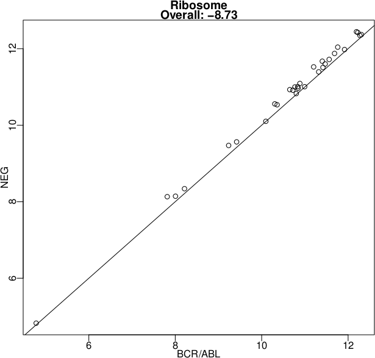
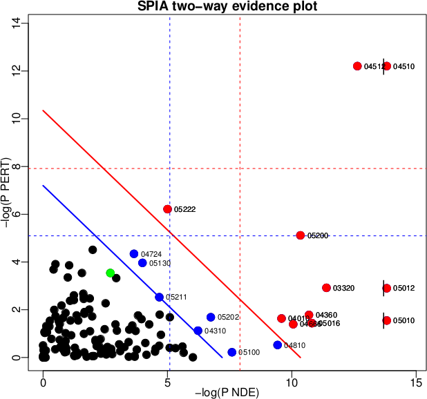
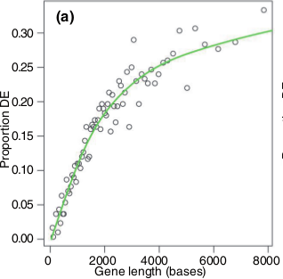

```{r style, echo=FALSE, results='asis'}
BiocStyle::markdown()
suppressPackageStartupMessages({
    library(edgeR)
    library(goseq)
    library(org.Hs.eg.db)
    library(GO.db)
})
```

# Motivation

Is expression of genes in a gene set associated with experimental
condition?

- E.g., Are there unusually many up-regulated genes in the gene set?

Many methods, a recent review is Kharti et al., 2012.

- Over-representation analysis (ORA) -- are differentially expressed
  (DE) genes in the set more common than expected?
- Functional class scoring (FCS) -- summarize statistic of DE of genes
  in a set, and compare to null
- Pathway topology (PT) -- include pathway knowledge in assessing DE
  of genes in a set

## What is a gene set?

**Any** _a priori_ classification of `genes' into biologically
relevant groups

- Members of same biochemical pathway
- Proteins expressed in identical cellular compartments
- Co-expressed under certain conditions
- Targets of the same regulatory elements
- On the same cytogenic band
- ...

Sets do not need to be...

- Exhaustive
- Disjoint

## Collections of gene sets

Gene Ontology ([GO](http://geneontology.org)) Annotation (GOA)

- CC Cellular Components
- BP Biological Processes
- MF Molecular Function

Pathways

- [MSigDb](http://www.broadinstitute.org/gsea/msigdb/)
- [KEGG](http://genome.jp/kegg) (no longer freely available)
- [reactome](http://reactome.org)
- [PantherDB](http://pantherdb.org)
- ...

E.g., [MSigDb](http://www.broadinstitute.org/gsea/msigdb/)

- c1 Positional gene sets -- chromosome \& cytogenic band
- c2 Curated Gene Sets from online pathway databases,
  publications in PubMed, and knowledge of domain experts.
- c3 motif gene sets based on conserved cis-regulatory motifs
  from a comparative analysis of the human, mouse, rat, and dog
  genomes.
- c4 computational gene sets defined by mining large collections
  of cancer-oriented microarray data.
- c5 GO gene sets consist of genes annotated by the same GO
  terms.
- c6 oncogenic signatures defined directly from microarray gene
  expression data from cancer gene perturbations.
- c7 immunologic signatures defined directly from microarray
  gene expression data from immunologic studies.

# Statistical approaches

Initially based on a presentation by Simon Anders,
[CSAMA 2010](http://marray.economia.unimi.it/2009/material/lectures/L8_Gene_Set_Testing.pdf)

## Approach 1: hypergeometric tests

Steps

1. Classify each gene as 'differentially expressed' DE or not, e.g.,
   based on _P_ < 0.05
2. Are DE genes in the set more common than DE genes not in the set?

<table>
<thead>
<tr class="header">
<td align="left"></td>
<td align="left"></td>
<td align="left" colspan=2>In gene set?</td>
</tr>
<tr class="header">
<th align="left"></th>
<th align="left"></th>
<th align="left">Yes</th>
<th align="left">No</th>
</tr>
</thead>
<tbody>
<tr class="odd">
<td align="left" background-color="white">Differentially</td>
<td align="left"><strong>Yes</strong></td>
<td align="left">k</td>
<td align="left">K</td>
</tr>
<tr class="even">
<td align="left">expressed?</td>
<td align="left"><strong>No</strong></td>
<td align="left">n - k</td>
<td align="left">N - K</td>
</tr>
</tbody>
</table>

3. Fisher hypergeometric test, via `fiser.test()` or `r Biocpkg("GOstats")`

Notes

- Conditional hypergeometric to accommodate GO DAG, `r Biocpkg("GOstats")`
- But: artificial division into two groups

## Approach 2: enrichment score

- Mootha et al., 2003; modified Subramanian et al., 2005.

Steps

- Sort genes by log fold change
- Calculate running sum: incremented when gene in set, decremented when not.
- Maximum of the running sum is enrichment score ES; large ES means
  that genes in set are toward top of list.
- Permuting subject labels for signficance


## Approach 3: category $t$-test

E.g., Jiang \& Gentleman, 2007; \Biocpkg{Category}

- Summarize $t$ (or other) statistic in each set
- Test for significance by permuting the subject labels
- Much more straight-forward to implement

Expression in NEG vs BCR/ABL samples for genes in the 'ribosome' KEGG
pathway; `r Biocpkg("Category")` vignette.

 


## Competitive versus self-contained null hypothesis

Goemann & B&uuml;hlmann, 2007

- Competitive null: The genes in the gene set do not have stronger
  association with the subject condition than other genes. (Approach
  1, 2)
- Self-contained null: The genes in the gene set do not have any
  association with the subject condition. (Approach 3)
- Probably, self-contained null is closer to actual question of interest
- Permuting subjects (rather than genes) is appropriate

## Approach 4: linear models

E.g., Hummel et al., 2008, \Biocpkg{GlobalAncova}

- Colorectal tumors have good ('stage II') or bad ('stage III')
  prognosis. Do genes in the p53 pathway (_just one gene set!_) show
  different activity at the two stages?
- Linear model incorporates covariates -- sex of patient, location of tumor

`r Biocpkg("limma")`

- Majewski et al., 2010 `romer()` and Wu \& Smythe 2012 `camera()` for
  enrichment (competitive null) linear models
- Wu et al., 2010: `roast()`, `mroast()` for self-contained null
  linear models

## Approach 5: pathway topology

E.g., Tarca et al., 2009, \Biocpkg{SPIA}

- Incorporate pathway topology (e.g., interactions between gene products) into signficance testing

- Signaling Pathway Impact Analysis

- Combined evidence: pathway over-representation $P_{NDE}$; unusual
      signaling $P_{PERT}$ (equation 1 of Tarca et al.)

Evidence plot, colorectal cancer. Points: pathway gene sets.
Significant after Bonferroni (red) or FDR (blue) correction.



## Issues with sequence data?

- All else being equal, long genes receive more reads than short genes
- Per-gene $P$ values proportional to gene size

 E.g., Young et al., 2010, `r Biocpkg("goseq")`

- Hypergeometric, weighted by gene size
- Substantial differences
- Better: read depth??

DE genes vs. transcript length. Points: bins of 300 genes. Line:
fitted probability weighting function.



## Approach 6: _de novo_ discovery

- So far: analogous to supervised machine learning, where pathways are
  known in advance
- What about unsupervised discovery?

Example: Langfelder & Hovarth,
[WGCNA](http://labs.genetics.ucla.edu/horvath/CoexpressionNetwork/Rpackages/WGCNA/)

- Weighted correlation network analysis
- Described in Langfelder & Horvath,
  [2008](http://www.biomedcentral.com/1471-2105/9/559)

## Representing gene sets in R

- Named `list()`, where names of the list are sets, and each element
  of the list is a vector of genes in the set.
- `data.frame()` of set name / gene name pairs
- `r Biocpkg("GSEABase")`

## Conclusions

  Gene set enrichment classifications

- Kharti et al: Over-representation analysis; functional class
  scoring; pathway topology
- Goemann \& B&uuml;hlmann: Competitive vs.\ self-contained null 

Selected \Bioconductor{} Packages

  | Approach          | Packages                                    |
  |-------------------|---------------------------------------------|
  | Hypergeometric    | `r Biocpkg("GOstats")`, `r Biocpkg("topGO")`|
  | Enrichment        | `r Biocpkg("limma")``::romer()`             |
  | Category $t$-test | `r Biocpkg("Category")`                     |
  | Linear model | `r Biocpkg("GlobalAncova")`, `r Biocpkg("GSEAlm")`, `r Biocpkg("limma")``::roast()` |
  | Pathway topology  | `r Biocpkg("SPIA")`                         |
  | Sequence-specific | `r Biocpkg("goseq")`                        |
  | _de novo_         | `r CRANpkg("WGCNA")`                        |

# Practical

This practical is based on section 6 of the `r Biocpkg("goseq")`
[vignette](http://bioconductor.org/packages/devel/bioc/vignettes/goseq/inst/doc/goseq.pdf).

## 1-6 Experimental design, ..., Analysis of gene differential expression

This (relatively old) experiment examined the effects of androgen
stimulation on a human prostate cancer cell line, LNCaP (Li et al.,
[2008](http://dx.doi.org/10.1073/pnas.0807121105)). The experiment
used short (35bp) single-end reads from 4 control and 3 untreated
lines. Reads were aligned to hg19 using Bowtie, and counted using
ENSEMBL 54 gene models.

Input the data to `r Biocpkg("edgeR")`'s `DGEList` data structure.

```{r prostate-edgeR-input}
library(edgeR)
path <- system.file(package="goseq", "extdata", "Li_sum.txt")

table.summary <- read.table(path, sep='\t', header=TRUE, stringsAsFactors=FALSE)
counts <- table.summary[,-1]
rownames(counts) <- table.summary[,1]
grp <- factor(rep(c("Control","Treated"), times=c(4,3)))
summarized <- DGEList(counts, lib.size=colSums(counts), group=grp)
```

Use a 'common' dispersion estimate, and compare the two groups using
an exact test

```{r prostate-edgeR-de}
disp <- estimateCommonDisp(summarized)
tested <- exactTest(disp)
topTags(tested)
```

## 7. Comprehension

Start by extracting all P values, then correcting for multiple
comparison using `p.adjust()`. Classify the genes as differentially
expressed or not.

```{r prostate-edgeR-padj}
padj <- with(tested$table, {
    keep <- logFC != 0
    value <- p.adjust(PValue[keep], method="BH")
    setNames(value, rownames(tested)[keep])
})
genes <- padj < 0.05
table(genes)
```

### Gene symbol to pathway

Under the hood, `r Biocpkg("goseq")` uses Bioconductor annotation
packages (in this case `r Biocannopkg("org.Hs.eg.db")` and `r
Biocannopkg("GO.db")` to map from gene symbols to GO pathways.

Expore these packages through the `columns()` and `select()`
functions. Can you map between ENSEMBL gene identifiers (the row names
of `topTable()`) to GO pathway? What about 'drilling down' on
particular GO identifiers to discover the term's definition?

### Probability weighting function

Calculate the weighting for each gene. This looks up the gene lengths
in a pre-defined table (how could these be calculated using TxDb
packages? What challenges are associated with calculating these
'weights', based on the knowledge that genes typically consist of
several transcripts, each expressed differently?)

```{r prostate-edgeR-pwf}
pwf <- nullp(genes,"hg19","ensGene")
head(pwf)
```

### Over- and under-representation

Perform the main analysis. This includes association of genes to GO
pathway

```{r prostate-goseq-wall}
GO.wall <- goseq(pwf, "hg19", "ensGene")
head(GO.wall)
```

### What if we'd ignored gene length?

Here we do the same operation, but ignore gene lengths

```{r prostate-goseq-nobias}
GO.nobias <- goseq(pwf,"hg19","ensGene",method="Hypergeometric")
```

Compare the over-represented P-values for each set, under the
different methods

```{r prostate-goseq-compare, fig.width=5, fig.height=5}
idx <- match(GO.nobias$category, GO.wall$category)
plot(log10(GO.nobias[, "over_represented_pvalue"]) ~
     log10(GO.wall[idx, "over_represented_pvalue"]),
     xlab="Wallenius", ylab="Hypergeometric",
     xlim=c(-5, 0), ylim=c(-5, 0))
abline(0, 1, col="red", lwd=2)
```

# References

- Khatri et al., 2012, PLoS Comp Biol 8.2: e1002375.
- Subramanian et al., 2005, PNAS 102.43: 15545-15550.
- Jiang \& Gentleman, 2007, Bioinformatics Feb 1;23(3):306-13.
- Goeman \& B\"uhlmann, 2007, Bioinformatics 23.8: 980-987.
- Hummel et al., 2008, Bioinformatics 24.1: 78-85.
- Wu \& Smyth 2012, Nucleic Acids Research 40, e133.
- Wu et al., 2010 Bioinformatics 26, 2176-2182.
- Majewski et al., 2010, Blood, published online 5 May 2010.
- Tarca et al., 2009, Bioinformatics 25.1: 75-82.
- Young et al., 2010, Genome Biology 11:R14.
